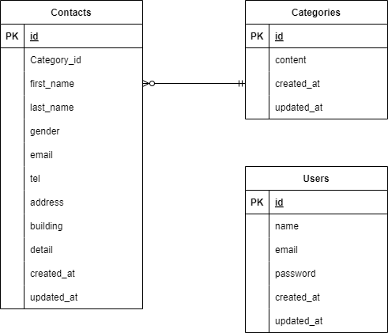
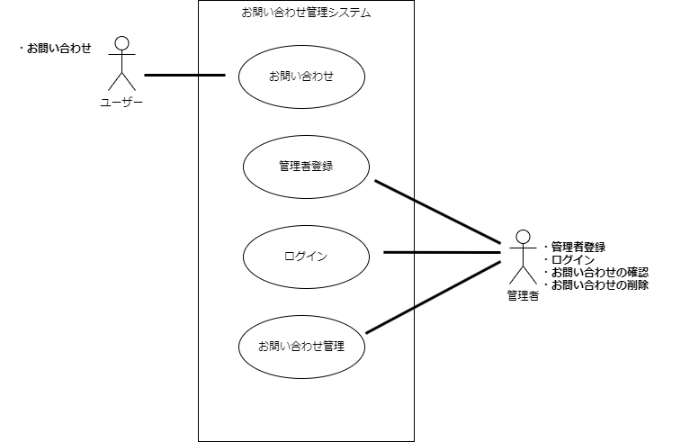

# お問い合わせフォーム

## 概要

このプロジェクトはお問い合わせの送信および管理を行うアプリケーションです。

- **ユーザー**: お問い合わせフォームに入力した内容を送信できます。
- **管理者**: 送信された問い合わせを確認および削除できます。

## 使用技術（実行環境）

- **OS**: Ubuntu 24.04.1 LTS
- **環境構築**: Docker 27.3.1
- **フレームワーク**: Laravel 8.x
- **プログラミング言語**: PHP 7.4.9
- **データベース**: MySQL 8.0.26
- **Webサーバー**: Nginx 1.21.1
- **バージョン管理**: Git

## 環境構築手順

### 1. リポジトリのクローン

以下のコマンドを実行してプロジェクトをクローンします。

```bash
git clone git@github.com:Shun-Adachi/contact-form-test.git
cd contact-form-test
```

### 2. Dockerコンテナのビルドと起動

以下のコマンドを実行してDockerコンテナをビルドおよび起動します。

```bash
docker-compose up -d --build
```

### 3. 必要なパッケージのインストール

Dockerコンテナ内で必要なパッケージをインストールします。

```bash
docker-compose exec php bash
# コンテナ内で以下を実行
composer install
cp .env.example .env
```

### 4. `.env` ファイルの設定

`.env` ファイルを編集し、以下の項目を環境に合わせて変更してください。

```env
DB_HOST=<データベースホスト>
DB_DATABASE=<データベース名>
DB_USERNAME=<データベースユーザー名>
DB_PASSWORD=<データベースパスワード>
```

### 5. アプリケーションキーの生成

以下のコマンドを実行してアプリケーションキーを生成します。

```bash
docker-compose exec php bash
# コンテナ内で以下を実行
php artisan key:generate
```

### 6. データベースのセットアップ

以下のコマンドを実行してデータベースをセットアップします。

```bash
docker-compose exec php bash
# コンテナ内で以下を実行
php artisan migrate
php artisan db:seed
```

## URL一覧

### 開発環境

- ユーザーお問い合わせフォーム: <http://localhost/>
- 管理者登録: <http://localhost/register>
- 管理者ログイン: <http://localhost/login>

## ER図

プロジェクトのER図は以下の通りです。



## ユースケース図

プロジェクトのユースケース図は以下の通りです。


